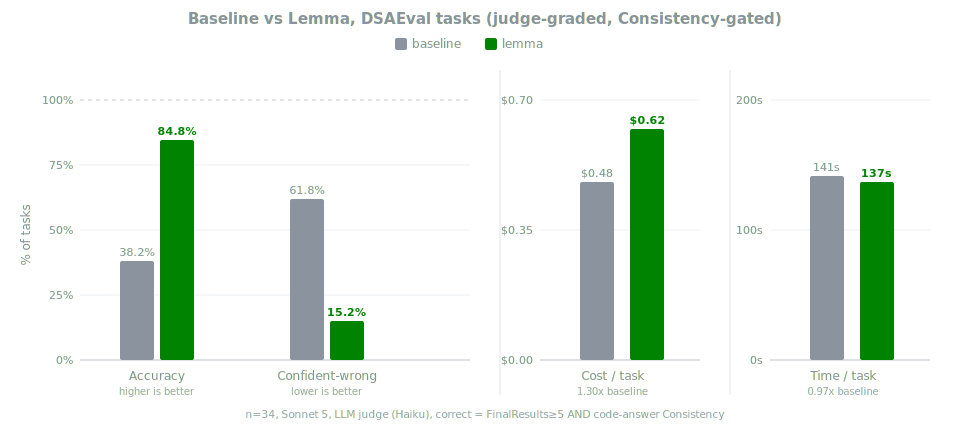

<p align="center">
  
</p>

<h1 align="center">Lemma</h1>

<p align="center">
  <em>Savvy, stateful, and reproducible.</em>
</p>

<p align="center">
  <a href="https://www.npmjs.com/package/@tkpratardan/lemma"></a>
  <a href="https://github.com/tkpratardan/lemma/releases"></a>
  
</p>

<p align="center">
  
</p>

---

## Why Lemma?

You know her. Hand her a notebook and she looks before she types: what the data says, why it matters, what to try next. Build her into your agent.

* **Without Lemma:** your agent edits `.ipynb` JSON blind, reruns the whole notebook to check one value, and trusts whatever it remembers a cell printing.
* **With Lemma:** your agent works in a live Jupyter kernel, reads the actual data state, sets seeds, validates assumptions, and leaves an ordered notebook that reruns clean.

Lemma is an MCP server, so any client that speaks MCP can run her, in an editor, a terminal, or a managed notebook environment. Hosts that also support hooks and skills get her full persona and skill set, not just the tools.

## What ships

Each configured agent gets three things:

1. **The persona.** A seasoned data scientist's judgment, delivered through whichever channel the host honors natively: MCP instructions, session-start hook, context file, or steering file.
2. **Live notebook tools.** Five MCP actions (`connect`, `read`, `run`, `edit`, `inspect`) drive a live notebook in VS Code/Cursor, PyCharm/DataSpell, or JupyterLab, so the agent reads what is in the kernel, not what it remembers.
3. **Ten skills.** One per kind of question an analysis can be, from wrangling messy sources to reviewing someone else's result.

Some hosts have no global path for an always-on ruleset. For a host-native guarantee there, copy the matching rules file into your project: [`.cursor/rules/lemma-datascience.mdc`](.cursor/rules/lemma-datascience.mdc) (Cursor), [`.windsurf/rules/lemma.md`](.windsurf/rules/lemma.md) (Windsurf), [`.github/copilot-instructions.md`](.github/copilot-instructions.md) (Copilot), or [`AGENTS.md`](AGENTS.md) (anything else). All are generated from `AGENTS.md`; copy as-is, hand edits get overwritten.

## Installation

```bash
npm install -g @tkpratardan/lemma
lemma
```

That is the whole setup. `lemma` detects every installed agent (Claude Code, Cursor, VS Code, Windsurf, Claude Desktop, Codex, GitHub Copilot CLI, Antigravity / Gemini CLI, opencode, OpenClaw) and plugs itself into each one.

To preview or narrow it:

```bash
lemma --dry-run            # preview every change, write nothing
lemma --only claude-code   # configure one agent; ids: cursor, vscode, claude-code,
                           #   claude-desktop, codex, copilot, openclaw,
                           #   antigravity-gemini, opencode, windsurf
lemma --configure jupyter  # prefer one notebook surface: vscode, pycharm, jupyter
lemma --help               # every option and value
```

### What it needs at run time

Lemma drives a live notebook, so the surface has to be up before the agent attaches:

| Surface | What you need |
| :--- | :--- |
| **VS Code / Cursor** | An open notebook with its kernel connected. The installer adds the Lemma extension for you. |
| **JupyterLab** | A running `jupyter lab` with `jupyter-collaboration` installed. Lemma auto-discovers a local server, or takes an explicit `server_url` and `token`. |
| **PyCharm / DataSpell** | The notebook's absolute path on disk and the `server_url` of its running Jupyter server. |

Connection details, environment variables, and surface switching are covered in [docs/tools.md](docs/tools.md).

### Any other MCP client

The npm install also puts `lemma-mcp` on your PATH. If your client is not on the auto-configured list, skip `lemma` and point the client's own config at the binary:

```json
{
  "mcpServers": {
    "lemma": { "command": "lemma-mcp" }
  }
}
```

### Unplugging

```bash
lemma --uninstall               # remove Lemma from every detected agent
lemma --only codex --uninstall  # remove it from one agent
```

Or use the host's own mechanism: `claude plugin uninstall lemma@lemma` in Claude Code, or delete the `lemma` entry from the client's MCP config anywhere else.

## Benchmarks

Headless Claude Code on [DSAEval](https://github.com/AMA-CMFAI/DSAEval): the same agent, with and without her. Real questions, real Kaggle datasets, and DSAEval's own judge rubric (Haiku), untouched. DSAEval wires its own agents with custom notebook-editing tools; those are not used here.

<p align="center">
  
</p>

Take the hardest task from every DSAEval task type and domain: baseline is confidently wrong more than 3 in 5 times. Lemma cuts that to 1 in 7, for 1.30x the cost and no extra time. Give both arms a clean single-answer question instead, one with no room for rigor to pay off, and they tie at 100%.

> **Note:** Not a random sample. We took DSAEval's 20 most common `task_type` labels and 20 most common `domain` labels and kept the single hardest task in each bucket (34 after dedup), where "hardest" means the combined length of the question and DSAEval's own reference reasoning. That reasoning is the answer key; only the judge sees it, after the agent has answered. Tasks rated below 3 by DSAEval's own confidence score and datasets over 10MB were skipped. [`select_dsaeval_hard_tasks.py`](evals/select_dsaeval_hard_tasks.py) rebuilds the selection.

Every script, model answer, and judge verdict sits in [`evals/`](evals/). Run [`run_dsaeval_hard.py`](evals/run_dsaeval_hard.py), or [`run_dsaeval.py`](evals/run_dsaeval.py) for simpler tasks.

## Docs

* [docs/tools.md](docs/tools.md) for the tool reference and connection arguments.
* [docs/architecture.md](docs/architecture.md) for system architecture.

## Contributing

We welcome contributions. See [CONTRIBUTING.md](CONTRIBUTING.md).

## License

MIT
