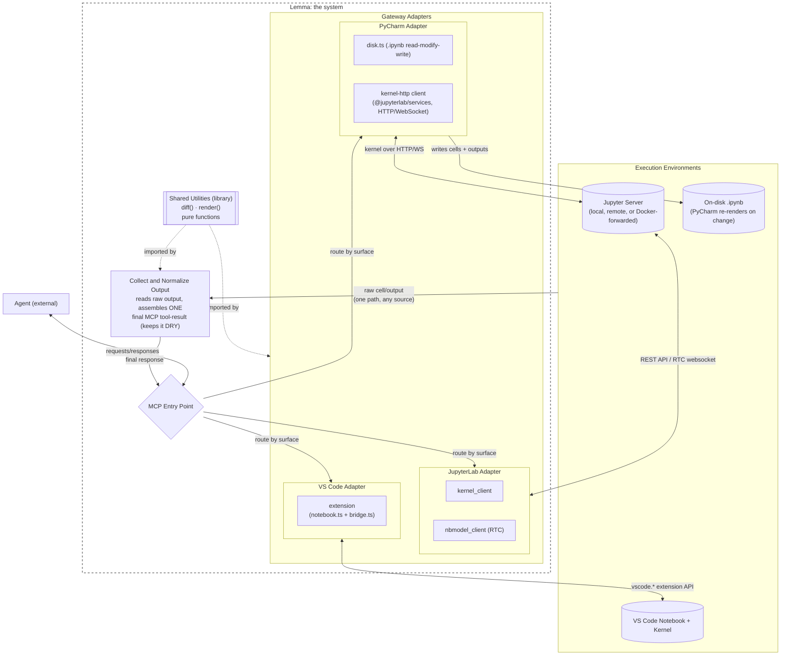
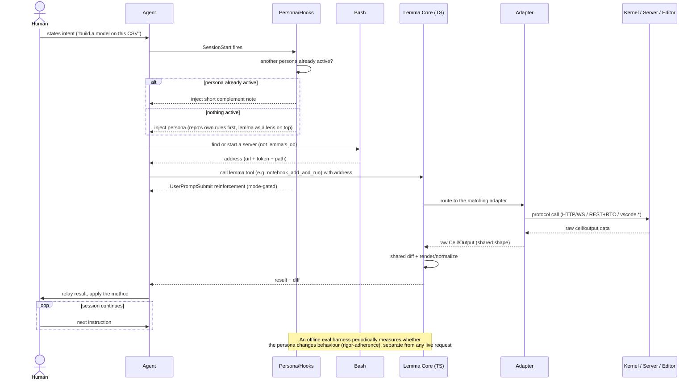

# Architecture

The system relies on two key perspectives: the component view, and the request-by-request workflow.

## Component view

Every backend's raw output reaches `Output_Norm` by a single path. `Output_Norm` is the only place a final MCP tool response is assembled. No adapter duplicates diffing or rendering.

All three adapters are pure TypeScript. `PyCharm` has no IDE plugin because PyCharm exposes no public API to drive its notebook UI. It talks to any accessible Jupyter server over HTTP/WebSocket via a `kernel-http` client built on `@jupyterlab/services`. This is the same mechanism `Jupyter` uses minus the RTC/Yjs document sync, since there is no editor tab to keep live. It writes cells and outputs to the `.ipynb` on disk through `disk.ts`, and PyCharm reloads the notebook when the file changes. An earlier design ran this kernel-http client's execution through a separate Python process (`jupyter_client` over ZMQ) for the one case the HTTP path did not cover. That process was removed once the HTTP path made it redundant for every other case. A standalone, agent-facing "headless" surface built on this same client also existed and was later removed as not useful to the product.

`Shared_Utils` is a library of pure functions (`diff()`, `render()`) that `Output_Norm` calls into, not an active pipeline stage. The JupyterLab, PyCharm, and VS Code adapters each have their own externally-owned notebook structure (RTC document, on-disk `.ipynb`, `vscode.NotebookDocument`).

## Directory structure

- `src/mcp/`: The Model Context Protocol entry point. It contains `server.ts` to register tools and route requests.
- `src/adapters/`: The pure TypeScript gateway adapters (`jupyterlab/`, `pycharm/`, `vscode/`, `kernel-http/`) that translate MCP requests into execution environment protocols.
- `src/utils/`: Shared logic. It includes pure functions like `diff.ts` and `render.ts` to collect and normalize output from adapters.
- `extensions/`: Editor extensions. It includes the VS Code extension code (`extensions/vscode/`) that bridges Lemma's adapter to the VS Code API.
- `scripts/`: Development and build tools, such as scripts to synchronize rules across agent configuration folders.
- `bin/`: Executable scripts like `install.js` used to install and set up the system.
- `skills/`: The specific agent skills that execute tasks rigorously. The rigor is enforced by the prompt instructions and the agent's persona.

## Workflow (one request, start to finish)

## Reading the two diagrams together

The component diagram shows the system boundary of lemma. Persona, skills, hooks, and kernel discovery are real but not the core code of lemma. They collapse to a single external `Agent` box and are decomposed in the workflow diagram. `Shared_Utils` and `Output_Norm` are the only place business logic lives. All three adapters are intentionally thin protocol plumbing. Lemma ships no live code-checking layer. Rigor lives in the persona and skills, and the eval harness is offline dev tooling that never runs as part of a live request, appearing only as a note in the workflow.
